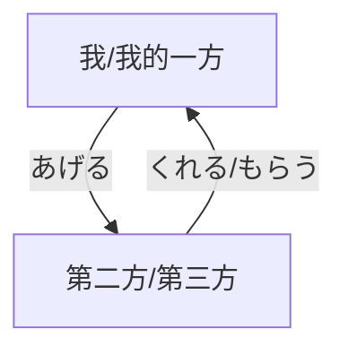

# 第廿六课

## 关键点速览

一、单词

1. 遅れる・間に合う
2. いつでも・どこでも・なんでも・だれでも
3. いつでも・いつも
4. 横・そば・隣

二、文法

1. んです
2. ていただけませんか
3. たらいいです

## 单词

一、弁

表示方言，可以在　弁的前面添加地点，表示某地的方言。例如：関東弁、関西弁、大阪弁、東京弁。

与此相同的单词还有　なまり・方言。訛り更加侧重于 口音。如：　訛りのない日本語（地道的日语）・田舎訛り（乡音）。

二、遅れる

表示迟到、赶不上等。

1. 晚点、耽搁

   約束の時間に遅れる。

   武さんは約束の時間に一時間遅れた。

   汽車が二十分遅れた。

2. 迟到、没赶上

   汽車に遅れた。

   学校に遅れた。

3. 钟表等的慢点

   この腕時計は五分遅れている。

对于这个单词要注意在使用不同的 助词时的含义不同。当表示 ~晚点了/来晚了，需要使用　が，当表示 没赶上~，需要使用　に。

三、連絡

这个词除了表示 联系（某人）外，还可以表示 和（某人）有联系。

1. 联系（某人）

   一日でも早く連絡してください。

   学校からの連絡。

   連絡を取る。

2. 和（某人）有联系/关系

   彼と連絡がある。

   連絡をつける。

### 辨析

#### いつも？いつでも

这两个词的意思在某些场合都可以使用，但含义稍有区别。いつも表示 总是、经常、平日，侧重于动作的频率高。强调动作的规律性和习惯性。例如：

+ 私は　いつもその店で食事します。
+ いつもの時間、いつもの場所で待っています。
+ いつも笑っています。

いつでも强调的时 不管什么时候都，即没有例外，随时都可以。例如：

+ いつでもいいから、来てください。

#### 横？そば？隣？

这三个词都表示 旁边，但侧重点有所不同。　となり是离说话人最近的。横是和说话人在一条横线上，相聚不算太远的旁边。そば表示的是一个范围，更多的有情感在内。

## 文法

## 练习

一、根据假名写汉字或者根据汉字写假名。

例：歴史：<u>れきし</u>      れきし：<u>歴史</u>

おおさかべん　　遅れます　　国会議事堂　　片づける　　もえるゴミ

にもつ　　れんらく　　都合　　さいふ　　間に合う　　拾う

場所　　探す　　うちゅう　　ちがう　　ひこうし

二、完成表格。

| 现在           | 否定 | 过去                 | 过去否定               |
| -------------- | ---- | -------------------- | ---------------------- |
| 帰るんです     |      |                      |                        |
|                |      | にぎやかだったんです |                        |
| やさしいんです |      |                      |                        |
|                |      |                      | 病気じゃなかったんです |

三、翻译下面的句子。

1. 明天我不去公司了。我有点头痛。（んです）
2. 你的日语真好。跟谁学的日语？（んです）
3. 这个题我不太懂，你可以帮我吗？（んですが、～ていただけませんか。）
4. 我手机没电了（電源が切れる），可以借你的手机吗？（んですが、～ていただけませんか。）
5. 我有一个请求。你可帮我拍张照吗？（お願いがあるんですが、～ていただけませんか。）
6. 我想去东京塔（東京タワー），该坐哪一站地铁？（～たらいいですか。）
7. 我该买哪部手机？（～たらいいですか。）

# 第卅七课

## 关键点速览

## 单词

### 事故・事件

殺す・撃つ・刺す・噛む

ひく~轧~・はねる~撞飞~・衝突する^しょうとつ^・追突する^ついとつ^

盗む・誘拐する・バイジャックする~劫机~

墜落する^ついらく^・爆発する・沈没する^ちんぼつ^

## 文法

### 被动态

#### 活用

动词的未然形 + れる・られる

| 書く→書かれる | 読む→読まれる |
| ------------- | ------------- |
| 見る→見られる | 寝る→寝られる |
| する→される   | 来る→こられる |

要注意的是一段动词和　くる的被动态和能动态是同形的，在句子中要注意区分。

#### 句型

**直接被动句**

表示 某人被某人……。某人受到送……。其中施动者使用助词　に表示。也可不出现施动者。

+ 母さんに叱られました。
+ 友達に誘われて、コンサートに行った。

表示 某个事物被（发明、创造、受欢迎）……。一般不出现施动者，如果施动者是发明创作该事物的，使用　によって表示。

+ この本は多くの人に読まれています。
+ 入学式は八月に行われます。
+ この製品は田中さんによって作られた。
+ 秦は始皇帝によって統一されました。

**间接被动句**

表示 某人的某物被其他人……。

+ わたしは妹に自転車を壊されました。
+ 名前を呼ばれました。
+ リーさんにケーキを食べられました。

但是如果是表示受益的情况，例如被修理好了，被修改了。要使用授受动词。

+ 母に日記を読んでもらう。
+ 田中さんに自転車を直してもらった。

表示 因为别人……而导致自己……。

+ 母に死なれて生活が苦しくなりました。
+ 子供に泣かれて、眠れませんでした。
+ 雨に降られて、困りました。

## 句型

## 练习

# 第卅八课

## 关键点速览

## 单词

### 名词

#### 赤ちゃん・小学校

赤ちゃん→子供→小学生→中学生→大学生→大学院生・修士→博士

　　　　幼稚園→小学校→中学校→大学　→大学院

#### 回覧

回覧：これは回覧です。

回覧する：雑誌を回覧する。

#### 嘘

うそをつく・うそを言う：说谎话

うそをつけ：你骗人

うそだ：那不是真的

#### 一昨年

三年前→おととし（前年）→去年（昨年）→ことし（今年）→来年（明年）→再来年（明後年）→三年後

#### 電源

電源を切る・電源が切れる：切断电源/没电了

電源を入れる：打开电源

電池（バッテリー）が切れる：电池没电了

電池を入れる・取り替える：放电池/换电池

#### 世話

1. 面倒を見る

子供の世話をする。

余計なお世話だ・大きなお世話だ。

2. 紹介する

就職の世話をする。

3. 厄介、迷惑

お世話になりました。

お世話をかけました。

世話になる。

### 动词

#### 育てる

<人、动物、植物>培养、养育、抚养、饲养、培育

子供・牛・花を育てる

#### いけない

1. 不好、不行

いけない子・言い方がいけない・その会社はもういけない

2. 糟糕、不好、遗憾

それはいけないね。

3. てはいけない

タバコを吸ってはいけない。

4. なければいけない（＝なければなりません）

時計を直さなければいけません

#### 整理する

整理する・片づける・しまう

引き出しの中を整理する

書類を整理する

#### 押す

推、摁、压、盖、贴

ドアを押す・自転車を押す

ボタンを押す・指で押す

ハンコを押す・拇印（ぼいん）を押す

#### かける

1. 挂、扬（帆）、称（重）

絵を壁にかける・帆（ほ）をかける・かければ重さがわかる

2. 戴着、系上、挂着、套着

眼鏡をかける・エプロンをかける/ひもをかける

3. 搭在、坐在、放在

ベテランに布団をかける・椅子に掛ける・火に鍋をかける

4. 盖上、蒙上

顔にマスクをかける・布団をかける

5. 锁上、扣上

鍵をかける・ボタンをかける

6. 开动

電話をかける・エンジンをかける

7. 花费

時間をかける・お金をかける

### 副词

#### きちんと

整整齐齐、端正、恰当、好好地

きちんと部屋を片付けた。

すべてがきちんとしている。

きちんと座る。

きちんと翻訳する。

きちんと言ったほうがいいじゃない。

### 形容词

#### おとなしい

<性格>老实、温顺、规矩、听话、乖巧

おとなしい子供

おとなしくしなさい。

おとなしくここで待っててね。

#### やさしい

1. ＜易しい＞容易、简单、易懂

易しい問題・易しい言葉・易しすぎる

2. ＜優しい＞优雅、优美；温柔、和气、温和

優しい声・優しい顔・優しい人・人にやさしくする

### 連体語と他

#### 大きな

只能够充当定语的词称为连体词。除了　大きな、小さな之外，还有之前学过的　こんな、そんな、あんな、どんな、この、その、あの、どの。

另外　大きな和　大きい的区别是　大きな可以修饰一些抽象的名词，例如：　変化、世話等，当然也可以修饰具体名词，例如：　足、音等。

#### ~製

前面可以接续 国家、原材料等。表示制作国、制作原料。

プラスチック製・中国製

#### ～年生

表示几年级的学生。

小学一年生・大学二年生

## 文法

### 名词化

在会话时，经常会出现动词（句）、形容词（句）等充当主语或者宾语的情况。此时可以在该词（句）后添加助词　の使其名词化。例如如下的句子：

你喜欢看电视吗？ 在这个句子中， 看电视充当了句子的宾语，在汉语中可以不借助其他成分而直接让动词、句子等成为句子的主语、宾语。在日语中则需要借助助词来使其成为一个语法意义上的名词。再比如之前学过的句型：

我的梦想是……。在这个句子中，使用的是　こと来使整个句子名词化。关于在名词化的过程中，使用　こと和　の有什么区别，在之后会学到，现阶段只需要记忆句型即可。除了上面的句型还有：

+ したことがあります
+ することができます

当名词化的部分<u>作为主语</u>时的句型是：　動詞の辞書形＋のは・のが　形容詞です。至于使用　は还是使用　が，则在之前的课程中讲过，当名词化的部分作为 话题谈论时，使用　は，当名词化的部分作为 主语（表示能力、喜恶）谈论时使用　が。另外在大小主语句^*^中，大主语使用　は，小主语使用　が。另外该句型的谓语部分也可以不是形容词，名词也是可以的。名词作为该句的谓语的句型放在后面。

例句：

+ テニスをやるのが好きです。
+ テニスを見るのは面白いです。

试着翻译下面的句子^**^：

+ 我不喜欢<u>看孩子</u>（子供を世話する）。
+ 高桥先生每天都很晚起床。
+ 现在去国外旅游是一件很容易的事情。
+ 学习日语不是一件容易的事情。
+ 山田跑的很快。
+ 小李不擅长做饭。

当名词化的部分<u>作为宾语</u>时的句型是：　動詞の辞書形＋のを　動詞。作为谓语的动词不仅仅包括课本上提到的　忘れる、知っている，当然还包括其他的动词，例如　見る、聞く等等。例如：

我忘记把照片拿回来了。在这个句子中，忘记后面的部分作为宾语存在。又比如：

我看见小李偷了部长的资料。在这个句子中，看见后面的部分作为宾语存在。

例句：

+ 写真を持ってくるのが忘れました。
+ 部長の資料が盗まれたのを知っていますか。

应当注意的是，在　忘れる在句型中，使用的是 动词的辞书形，而在　知っている的句型中使用的是 动词的连体形。这是因为 知道某件事，这件事情必然是已经发生或者是还未发生。已经发生则使用过去时，未发生则使用现在时。

还应当注意的是在　知っている句型的回答中，如果该事情从来就不知道，回答使用　知りません。如果是因为被提问而知晓了该事则使用　知りませんでした。

+ ー　木村さんが結婚したのを知ってしますか。
  ー　いいえ、知りませんでした。
+ ー　ミラさんのメルアドを知っていますか。
  ー　いいえ、知りません。

试着翻译下面的句子^***^：

+ 我忘记写作业了。
+ 我忘记给山田买礼物了。
+ 山本被老师骂了，你知道吗？
+ 下个周二就要去中国出差了，你知道吗？

以上是动词句名词化的部分，除了动词可以名词化之外，形容词、形容动词都可以名词化。活用方法是 将形容词、形容动词变成连体形。

例句：

+ 今一番欲しいのは何ですか。
+ 趙さんにとって一番大切なのは何ですか。
+ ご主人と初めて出会ったのは大学二年生の時です。

试着翻译下面的句子^****^：

+ 人生中最快乐的是什么时候？
+ <u>对现在的我来说</u>（今の私にとって）学日语是最重要的事情。

^*^ 大小主语句即之前学过的　～は～が～。大主语表示整体，小主语表示部分。例如：

+ 象は鼻が長い。
+ 私はミラーさんが好きです。

^**^ 翻译的参考如下：

+ 子供を見るのが嫌いです。
+ 高橋さんは毎日起きるのが遅いです。
+ 今海外へ旅行するのが簡単です。
+ 日本語を勉強するのが難しいです。
+ 山田さんは走るのが速いです。
+ リーさんは料理を作るのが下手です。

^***^ 翻译的参考如下：

+ 宿題をやるのを忘れました。
+ 山田さんにプレゼントを買ってあげるのを忘れました。
+ 山本さんが先生に怒られたのを知っていますか。
+ 来週の火曜日に中国へ出張するのを知っていますか。

^****^ 翻译的参考如下：

+ 人生の中で一番楽しいのはいつですか。
+ 日本語を勉強するのは今の私にとって一番重要なことです。

## 句型

## 练习

# 第卅九课

## 关键词速览

## 单词

### 名词

#### お疲れさん

お疲れさまでした（目上や目下の人に）

ご苦労様でした（目下の人に）

お疲れ様です・お疲れ様・お疲れさん・お疲れ。

ご苦労様です・ご苦労様・ご苦労さん・ご苦労。

お疲れさま：

> お疲れさまは仕事を終えた人に対して使う、日常的な決まり言葉。
>
> 目上の人に対しても使えるが、その仕事が話し手のためにしたものであれば、使えない。
>
> 〇部長、出張、お疲れ様でした。
> 　　✕部長、ご説明、お疲れさまでした。（直接感謝したほうがいい）
>
> また、会社などで、同僚が自分より早く退社するときの挨拶表現として日常的に使う。
>
> 同僚：お先に失礼します。
> 　　わたし：お疲れさまでした。

ご苦労さま：

> 　ご苦労様は自分が依頼した仕事をしてくれる人に対して使う、非地上的な決まり言葉。程度の差はあるが感謝の気持ちを含む表現。
>
> こんにちは。ご注文のピザ、お届けに来ました。
> 　　ありがとう。暑いのにご苦労さん。
>
> 基本的には自分より下の立場の者に向けられる言葉。したがって、目上の人には使えない。
>
> ✕課長、会議、ご苦労様でした。
>
> 部下や後輩、サービスを依頼した会社などに使う。

#### 邪魔

1. 障碍、妨碍、碍事

邪魔だから、早くどいてくれ。

邪魔するなよ。

2. 打扰、拜访

お邪魔します・お邪魔しました。

#### 途中

動詞や名詞の　途中で 表示在做……的途中。

話の途中で席を外した。

家に帰る途中で雨が降り出した。

途中で財布を忘れたことに気が付いた。

### 动词

#### 倒れる

<人、物、建筑物、公司、政权>摔倒、病倒、倒塌、倒闭、垮台

花瓶・家・会社が倒れる

働きすぎで倒れた

#### がっかりする

失望、颓废、心灰意冷

試合に負けてがっかりする。

彼女が来なくてがっかりした。

#### ぶつかる

撞上、碰上、遇上

壁にぶつかる・人にぶつかって転んだ・困難にぶつかる

#### 答える

質問・問題・アンケートに答える

### 形容词

####　うれしい？楽しい？

两者都表示快乐、愉快。但前者一般表示某个人很开心，快乐。后者一般表示某个活动、事情、环境有趣、愉快。

きのうのパーティー、楽しかったの。

今日はなんだか、うれしい。

### 副词

#### また

又、再、还

また会いましょう・じゃ、またあした。

パソコンがまた壊れた。また電話します。

#### いまでは

主要用于以前和现在的对比情况，表示以前（不）……，而现在（不）……。

以前は、泳げなかったが、たくさん練習したので、今では（今は）とてもはやく泳げるようになった。

### 心情

うれしい・楽しい・面白い・羨ましい・ワクワクする

寂しい・悲しい・恥ずかしい・びっくりする・がっかりする

うっとりする・懐かしい

イライラする・ドキドキする・ハラハラする

## 文法

### て・で

在之前的课程中学习了　て・で的下面几种用法：

1. 动作行为的连接。
2. 动作行为发生的方式、状态。

在本课中学习的是 表示原因、理由。这种原因和理由所带来的结果是非意志的。即后续的句子中不可以是 请求、许可、邀请等。在表示 意志的结果中，应当使用　から。

+ ニュースを聞いてびっくりしました。
+ 都合が悪くていけません。
+ 地震で家が倒れました。

试着翻译下面的句子^*^：

+ 高桥因为生病而<u>好几天</u>（何日も）没来上课了。
+ 因为事故电车晚点了。
+ 公交车<u>老是</u>（なかなか）不来，<u>很难办</u>（困りました）。
+ 因为不知道路，不得不<u>多次</u>（何度も）向别人问路。
+ 房间太小了，放不下大的桌子。
+ 预习复习太麻烦了，完全没有玩耍的时间。

### ので

活用方法为 动词和形容词、形容动词的连体形，名词则是 名词+なので。接续时，既可以接续简体，也可以接续敬体。

+ 用事があるので、お先に。
+ 用事がありますので、お先に失礼します。

试着翻译下面的句子^**^：

+ 晚上会变冷，所以穿外套出去会比较好。
+ 因为感冒了，所以向学校请了假。
+ 这本词典很方便，我平时都在用它。
+ 身体不太舒服，我可以请个假吗。

另外，在之前的课程中学习的　から也表示原因、理由，两者的区别如下：

1. 活用上的不同，在接续动词和形容词时是相同的，但是在接续形容动词和名词时：
    形容動詞・名詞 ＋ だから・ですから
    形容動詞・名詞 ＋ ので
2. 意义上的不同，虽然都是表示原因和理由，但是　ので更倾向于表达客观的理由，因此可用于辩解或者请求。而　から则更倾向于表达主观的理由，因此可用于表示命令、禁止、意志等的句型。

例如：

+ 乗っていたバスが故障したので、遅れました。
+ 寝坊したから、遅れてしまいました。
+ 少し頭が痛いので、午後の授業を休んでもいいですか。
+ 電車に遅れるから、早く行きましょう。

^*^ 翻译的参考如下：

+ 高橋さんが病気で何日も授業を休んでいます。
+ 事故で電車が遅れました。
+ タクシーがなかなか来なくて困りました。
+ 道がわからなくて何度も人に聞かなければなりませんでした。
+ 部屋が狭くて、大きい机が置けません。
+ 予習復習が大変で全然遊ぶ時間がない。

^**^ 翻译的参考如下：

+ 夜は寒くなるので、コートを着て行ったほうがいいですよ
+ 風邪をひいたので、学校を休みました。
+ この辞書は便利なので、いつも使っています。
+ 気分が悪いので、休んでもいいですか。

## 句型

## 练习

# 第四十课

## 关键点速览

## 单词

### 动词

#### 到着・出発

翻译^*^（下略）：

我昨天到的东京。

列车三点到站。

#### 酔う

+ 因为……而喝醉／晕：～に酔う

他喝了酒就会<u>发疯</u>（おかしくなる）^**^。

我不晕船。

#### 測る

需要注意的主要是这个词汉字的写法。除了可以写作　測る，还可以写作　量る、計る。可以翻译成：计量、测量、称等和数量词相关的含义。

数・時間・山の高さを測る

#### いらっしゃる

这个词需要注意的点主要有：

+ 这个词是很多普通动词（行く・来る・いる）的敬语。

+ 另外之前学习过的　いらっしゃい・いらっしゃいませ也是来源于这个词。因为有 来的含义，所以会翻译成 您来了（欢迎）。但需要注意的是这两个词的使用场景有所不同。前者是家里主人欢迎客人，后者是店员欢迎客人。

+ 这个词的第一连用形活用不是按照标准的活用规则。与之相同的还有　くださる。

#### 確かめる

  需要注意的主要有两点：

+ 这个词是一个他动词：目的を確かめる・敵の様子を確かめる

+ 第二个点是和下面的文法相关：

  句子 + か、確かめる。（确认某件事情。）

  句子 + かどうか、確かめる。（确认某件事情是否）

翻译^***^：

请再次确认一下明天会议的时间。

请确认一下小李夫妇结婚是什么时候。

请确认一下社长明天会不会出席会议。

#### 合う

这个词也有诸多写法，如前课所述，有：会う・遭う・逢う・遇う等诸写法。本课写法的含义主要是：会合、合适、相称、一致、符合、准。这个词是自动词。

口・目・足・体に合う

気・眼鏡・サイズ・意味が合う

#### 積む

这个词的意思是：堆积、装载、积累。这是一个他动词。

石を三つ積む・船に荷物を積む・経験を積む

### 名词

#### 間違い

主要是注意这个的义项。他可以翻译成很多和 错误相关的意思。例如：错、错误、过错、差错、意外事故。

发现错误／改正错误^****^。

谁都会犯错。

希望不要出现意外。

#### 本・杯・個

这两个数量词可以计量的物品有很多。　本主要用来修饰细长（条状／棍状）物品。

本：紐、縄、タオル、ズボン、ワイシャツ、川、ボールペン、映画、ビール、電池、タバコ

注意　本、杯的音变：一本、三本、六本、八本、十本、何本

#### 必要

这个词的词性是形容动词和名词。可以翻译为 必要，需要。

需要的钱款^*****^。

这件事有必要大家一起商量。

没必要和高桥解释。

#### 其他

テスト：テストを受ける・テストに合格する・中間テスト・期末テスト・ペーパーテスト

成績：成績がいい・成績を上げる／下げる・成績が上がる／下がる

問題が出る：問題を出す。要注意这两组词有两个意思，一个是“出题”，一个是“提出问题”。

傷：需要注意的是这个词不仅可以表示人的伤（伤口、创伤），还可以表示物品的瑕疵、毛病。所以有时也可写作　疵・瑕。例如：この皿に傷がある。

以下・以上：五歳以下・一万円以下・私以下・去年以上。

^*^ 昨日東京に到着しました。・列車は三時に到着します。

^**^ 彼は酒に酔っておかしくなった。・船に酔わない。

^***^ 明日会議の時間をもう一度確かめてください。・李さんたちの結婚式はいつか確かめてください。・社長は明日の会議に出るかどうか、確かめてください。

^****^ 間違いに気づく・直す。・誰にでも間違いがある。・間違いがなければいいけど。

^*****^ 必要なお金。・みんなで相談する必要がある・高橋に説明する必要がない。

### 数量词

#### 単位

| 面積               | 長さ     | 体積・容積         | 重さ       |
| ------------------ | -------- | ------------------ | ---------- |
| 平方センチメートル | ミリ     | 立方センチメートル | ミリグラム |
| 平方メートル       | センチ   | 立方メートル       | グラム     |
| 平方キロメートル   | メートル | シーシー・㏄       | キロ       |
|                    | キロ     | リットル・ℓ        | トン・t    |

#### 計算

|                   |      |      |
| ----------------- | ---- | ---- |
| 足す              |      |      |
| 引く              |      |      |
| かける            |      |      |
| 割る              |      |      |
| イコール          |      |      |

#### 線・形・模様

直線・曲線・点線

円・三角形・四角形

縦じま・横縞・チェック（格子）・水玉・花柄・無地

## 文法

### 形容词变名词

部分动词可以通过活用为第一连用形来变成相应的名词。例如：帰り、行き、喜び。

与此相对应的，形容词也可以通过活用变成相对应的名词。活用方式为：-い+さ。例如：

高さ、長さ、重さ、速さ、深さ、大きさ。

### 句子 + か、~

（确认、询问、调查、记得……）（某件事情……）

你知道高桥他们什么时候结婚的吗？^*^

请向老师问一下这次的考试在哪举行。

我们在讨论这个暑假去哪玩。

### 句子 + かどうか、~

（确认、询问、调查、知道）（某件事情是不是……）

不知道他们是不是结婚了。^**^

请看一下会议是不是明天下午两点举行。

我们在商量要不要去参加这次的派对。

### てみる

表示尝试。类似于中文的“动词 + 看看”。

你尝尝看。^***^

我想试着用日语发表。

^*^ 高橋さんはいつか結婚したか、わかりますか。

先生に次の試験はどこか、聞いてください。

今、夏休みにどこへ遊ぶか、相談しています。

^**^ 彼たちは結婚したかどうかわからない。

会議は明日の二時かどうか確かめてください。

今度のパーティーに行くかどうか相談しています。

^***^ 食べてみて。

日本語で発表してみたいと思いますが。

## 句型

## 练习

# 第四一课

## 关键点速览

## 单词

### ずつ

リンゴを5個ずつ分ける
机と椅子を二つずつ用意する
10人ずつを1チームとする

3人に一つずつ渡す
一人に3枚ずつ渡す
二人ずつ組む

1日に3回ずつ飲みます
毎朝1本ずつ牛乳を飲む
毎日2時間ずつ勉強する

### 興味

有兴趣、没兴趣

失去兴趣

对……有兴趣

### あげる・さげる

[1] 提高、改善

提高成绩、速度、价格、技术

[2] 举起、抬起、扬起

把行李放到书架上。

有问题的请举手。

<u>羞愧的</u>（恥ずかしい）抬不起头来。

放<u>烟花</u>（花火）庆祝。

<u>大声</u>（声を上げる）<u>求救</u>（助けを呼ぶ・求める）。

### 助ける

帮助父亲的工作

帮他搬行李。

### 其他

お姫様・ある人

## 文法

### 授受动词（敬语）

在之前的学习中，已经学习了如何表达给与和接受，本节课在之前的基础上，学习如何更加尊敬的表达上述的意思。

在本课中学习的则是以上三个动词在敬语中的说法。

日语中的敬语分为**尊敬语**、**谦让语**。就是说尊敬语指的是**对方的行为**。谦让语指的是**自己的行为**。

那么上述三个词汇的敬语分别是：

あげる→やる・さし上げる
くれる→くださる
もらう→いただく

需要注意的是**くださる**的活用是特殊的。

另外要注意的是**やる**一般是施益给地位比自己低的人或者动植物。而**さしあげる**比较少使用，有点书面化。

句型使用和之前的学习完全相同，授受的对象使用**に**来表示。

翻译（下略）^*^：

+ 部长送了我一束花。
+ 生日的时候，朋友送给了我一本英语书。
+ 别忘了给花浇水。
+ 儿子生日的时候，我朋友给了他一个玩具。
+ 老师给了儿子一百分。

另外，与之前的授受动词作为助动词来表示相关动作的受益行为相同，也可以使用上述的敬语授受动词来表示相关的收益动作。只是比普通的授受动词更加尊敬而已。

+ 課長に手紙の間違いを直していただきました。
+ 部長の奥さんがお茶を教えてくださいました。
+ 部長が駅まで送ってくださいました。
+ 部長がレポートを直してくださいました。
+ 私は息子に紙飛行機を作ってあげました（やりました）。
+ 私は犬を散歩に連れて行ってやりました。

翻译^**^：

+ 社长帮我叫了辆出租车。
+ 我教小李英语，小李教我日语。
+ 部长到车站来接的我。
+ 妈妈给我讲了她以前的故事。
+ 我经常给儿子讲以前的故事。

另外，我们在之前的课中学习了**ていただけませんか**来表示请求别人帮助自己做某件事情，本课中的**てくださいませんか**与之相同，只是礼貌程度不如前者高。

+ そのコピー機の使い方を教えていただけませんか・教えてくださいませんか。
+ 赤いビルへの行き方を教えていただけませんか・教えてくださいませんか。

翻译^***^：

+  能告诉我这个汉字的发音吗。
+ 能帮我买本书吗。
+ 请慢点说可以吗。

^*^ 翻译：

+ 部長さんから花をいただきました。・部長さんが花をくださいました。（下同）
+ 誕生日の時、友達から英語の本をいただきました。
+ 花に水をやるのを忘れないでください。
+ 誕生日の時、息子が友達から玩具をいただきました。
+ 息子は先生から百点をいただきました。

^**^ 翻译：

+ 社長がタクシーを呼んでくださいました・社長にタクシーを呼んでいただきました。
+ 部長さんが駅まで迎えに来てくださいました。
+ 母に昔の話をしていただきました。
+ よく息子に昔の話をしてあげます。

^***^翻译：

+ この漢字の発音を教えてくださいませんか。
+ 本を買ってくださいませんか。
+ ゆっくり話してくださいませんか。

## 句型

## 练习

# 第四二课

## 关键点概览

## 单词

### 並ぶ

**词性**：自動詞。经常搭配的助词有が、に。

**义项**：

①列を作る（排队；排列）

+   一列に並ぶ・縦に並ぶ・横に並ぶ。

+   一時間並んだ・数百人の人が入り口に並んでいる。高層ビルが並んでいる。

②同じ場所にたくさんある（陈列；摆满）

+   商品が机に並んでいる・どのページにも数字が並んでいる

**他動詞**：並べる

①列にする（排队；排列）

机を二列に並べる・本をABC順に並べる

②きちんと置く（摆放；陈列）

食卓に料理を並べる

③列挙する（列举）

欠点を並べる・原因を並べる

### 混ぜる

**词性**：他动词。经常搭配的助词有を、に、と

**义项**：

①合わせて入れる（混合）

小麦粉^こむぎこ^と砂糖を混ぜる

お米に麦を混ぜて食べます・レモンジュースに蜂蜜^はちみつ^を少し混ぜるとおいしくなる。

②攪拌する（搅拌）

スプーンでよく混ぜて食べる・砂糖と塩を入れてよく混ぜる

### 包む

紙などで、巻いて：新聞紙で本で包む・贈り物を包装紙に包む・服を風呂敷に包む

注意使用　で和　に的区别：一个表示 用……包起来。一个是 把……包进……里面。

### 沸かす

**词性**：他动词

お湯を沸かす・風呂を沸かす

**自动词**：沸く：風呂が沸く・やかんの湯が沸く

### 広める

範囲を、普及する：知識を広める・見聞を広める・宗教を広める・共通語を広める

広く知らせる：名を世界にも広める

広げる・広める　広がる・広まる

どちらにも抽象的な意味を表せるが、広げると広まるは具体的なことにも表す。例えば、面積や幅とか。

### 割る

**义项**：

①壊す：ガラスを割る・皿を落として割る

②二つ以上にする：ケーキを四つに割る・卵を割る・お菓子を十人に割る

③割りさん：四十を八で割る。

**其他的简单的四则运算说法**

プラス・足す　マイナス・引く　かける　わる　イコール

### 注ぐ

流れ込む・かける・注ぐ：黄河は渤海湾にそそぐ・木に水を注ぐ・ガラスに酒を注ぐ

### 丈夫

①体がいい：体が丈夫です。

②壊れにくい

### なぜ

简单的区分下面三个表示“为什么”的单词：

なぜ：文章語

なんで：口語、目上の人にはダメ

どうして：感情をこめて

体会一下下面的两个句子：

-   今日はなぜ遅れたのですか？

-   今日はどうして遅れたのですか？

「なぜ」も「どうして」も理由や原因を問う疑問詞ですが、「なぜ」の方が直接的に理由や原因を問う疑問詞です。

「どうして」には方法や経過・経緯の疑問も含まれるため、やや間接的であり、遠まわしに理由や原因を問うことができます。

相手を責めたり追求したりせず失敗の理由を知りたいというときには「どうして」を使うことが多くなります。

反対に、実験やビジネスの場で失敗の理由や原因を明確に知りたいときには「なぜ」を使うことが多いですね。

また、文語では「なぜ」、口語では「どうして」や「なんで」を使います。

### 蓋

和该单词相关的组合：

蓋を開ける・閉める

蓋をする・かぶせる

蓋が取れない

### 体温計

### 楽しみ

和该单词相关的组合：

人生の楽しみ

釣りを楽しみとする

いい音楽を聴くのが私の楽しみです・

楽しみにする

### ローン

ローンを払う・借りる

## 文法

### ために

動詞の辞書形・名詞のために

需要注意的是在该句型中动词都是 意志动词^*^（即动词所表示的行为是人为可控的）。而非意志动词都是自动词（当然，部分自动词也是意志动词。同时注意该句型一边前后主语相同。

+   自分の店を持つために、貯金しています。
+   健康のために毎朝走っています。

翻译^**^：

+   为了听清楚，坐在了前面。
+   给朋友准备派对。
+   弟弟为了考试合格，努力学习。
+   他为了接<u>参考书</u>（参考書^さんこうしょ^），去了图书馆。
+   小野给森先生做饭。

区分使用ために・ように：

+   ために的动词是词典形（意志动词）。
+   ように的动词是可能形。也可以是非意志动词。另外，动词也可是使用否定式。

+   ために的前后主语是一致的。
+   ように的前后主语无要求。

+   ために是表示目的，一般是一个动作。为了能够达成这个动作而做某件事。
+   ように虽然也表示目的，但该目的可以看作是一种状态，为了（变成……状态）而做某件事。

看看下面的句子应该使用哪个句型呢？^***^

+   よく分かる「ように・ために」教えてください
+   弟が試験に合格する「ように・ために」私は一生懸命に励ました。
+   会議を早く始める「ように・ために」、スケジュールを調整した。
+   風邪を引かない「ように・ために」、気をつけてください。
+   アメリカへ留学する「ように・ために」、お金を貯めています。
+   ダイエットの「ように・ために」この1週間リンゴしか食べていない
+   日本語が上手になれる「ように・ために」一生懸命日本語を勉強している。

### に

動詞のに・名詞に使う・いい・便利・役に立つ・時間がかかる

+   釣りに行く・散歩に出かける・忘れ物を取りに家に戻る
+   持ち運びに便利だ・生活に必要なもの
+   資料を調べるのに二日かかる・そのパソコンを買うのに二万元かかる。

请整理一下我们所学习的该助词的用法。

### も

用于强调数量的巨大。竟然。

+   歩いて30分もかかるんだったらタクシーで行きましょう。
+   えっ，あと1週間もかかるんですか。
+    雪が1メートルも積もった。

翻译^****^：

+   要花一百万日元啊，那可买不起．
+   原以为谁也不会来，没想到竟来了十个人．
+   <u>一个班</u>（一^ひと^クラス）竟有五十人吗?

### によって

+   この製品はイギリス人のデザイナーによって作られた。
+   この建物は有名な建築家によって設計^せっけい^されました。
+   秦^しん^は始皇帝^しこうてい^によって統一^とういつ^されました。

^*^： 意志动词和非意志动词

一、日语意志动词，反映按人或“有情物”的意志去完成的动作行为。主要分为以下两种情况。

　　1. 自控动作（指大脑能够控制的动作），如：行く、买う、作る。
   2. 自控心理活动（指大脑能够控制的心理活动）。如：思う、考える、信じる。

二、非意志动词，反映人的自发性动作、生理心理现象、能力、以及“非情物”的运动。以下情况都属于非意志动词。

　　1. 自发心理现象。如：饱きる、慌てる、はにかむ（腼腆、羞涩）等。
   2. 生理现象。如：疲れる、しびれる、老いる等。
   3. 心理性生理现象。如：うなだれる、震え上がる等。
   4. 能力。如：できる、闻こえる、话せる、分かる等。
   5. 偶发事件。如：出会う、失う、忘れる、しくじる（失败）等。
   6. 动植物的运动状态。如：育つ、枯れる、咲く等。
   7. 自然现象。如：光る、霞む、降る等。
   8. 物理运动。如：流れる、増える、溜まる等。
   9. 抽象现象。如：ある、あまる、终わる等。

^**^：

+   話をよく聞くために、前のほうに座ります。
+   友達のためにパーティーを準備しています。
+   弟は試験に合格するために、一生懸命に勉強した。
+   彼は参考書を借りるために、図書館へ行った。
+   小野さんは森さんのために料理します。

^***^：「ように・ように・ために・ように・ために・ために・ように」

^****^：

+   100万円もするんじゃちょっと買えないわね。
+   だれも来ないかと思ったら10人も来た。
+   ひとクラスに50人もいるんですか。

## 句型

## 练习

# 第四三课

## 关键点速览

## 单词

### 今にも

见文法部分。经常和　そうだ搭配。表示 马上就要（发生……）；眼看着就要……

### 取れる

+   ボタンが取れた服

### 落ちる

+   石が山の上から落ちてきた。
+   屋上から落ちてけがをした。
+   飛行機が海に落ちた。
+   財布が道に落ちた。

他動詞：落とす

+   爆弾を落とす
+   財布を落とした
+   本を床^とこ^ ~地板~に落とした。

### 増える・減る

+   体重が増える・水が増える・家族がもう一人増えた

注意增加了和增加到的区别：

+   百人に増える・百人増えた

### 切れる

①能切断、锋利、快

この包丁では肉を切れない・このナイフは切れない。

②断开、中断

縄が切れた・電球が切れた。

③卖光、用尽

電池が切れた・品が切れる・水が切れる。

### 上がる・下がる

### なくなる

亡くなる・無くなる・無くす・亡くす

①消失、没了、用完了、丢失了

時計がなくなる・お金が無くなる・自信がなくなる・タバコがなくなる

②死去了

父が亡くなったと聞いてびっくりした。

### 楽

注意这个汉字的发音。另外这个词的意思，即可表示（心理上的）轻松、舒适，也可以表示（行为、生活等的）容易、轻松。

+   楽な気分
+   楽に暮らす
+   気が楽になる
+   楽に勝つ

### 匂い・香り・味

匂いという言葉は快いものの時にも、よくないものの時にも使うことができます。

一方、香りという言葉は良いものの時にしか使うことができません。

## 文法

### ～そうです

1.  可以接续动词的第一连用形，用于表示 马上就要的意思。经常和　今にも搭配。因为表示的是现象，所以多使用　が表示主语。（推测）

+   今にも雨が降りそうだ。
+   もうすぐ桜が咲きそうだ。
+   これから寒くなりそうだ。

+   本棚から本が落ちそうだ。
+   寒くて死にそうだ。
+   赤ちゃんが今にも泣きそうだ

2.  可以接续形容词或者形容动词的词干。用于表示 看上去好像的意思（推测）。要注意的是，当形容词是よい、ない的时候，应该的接续方式是：よさそう・なさそう。多不用于自身，一般来说，描述其他人的思想情感时，不直接使用动词原形，而是用间接的方式来表示，本句型就是其一。

+   この料理は辛そうです。
+   彼女は頭がよさそうです。
+   この机は丈夫そうです。

+   お弁当、おいしそうですね。
+   あの人はお金がなさそうです。
+   今度のテストは難しくなさそうです。

上述句型的【否定式】可以是：

Vそう「に」「も」ない。

彼女は来そうにもない・来そうもない。

Aそうではない・Aではなさそうだ・Aくなさそうだ。

あまり面白くなさそうです・あまり面白そうではないです。

体が丈夫そうではないです・丈夫ではなさそうです。

另外还需要注意，そうだ可以进行活用。

雨が降りそうな天気・難しそうな本・楽しそうに昔の話をした。

### てくる・ていく

1.  我们之前学过了可以使用动词的第二连用形来修饰动词，所以该动词的第一个意思就是　去的方式、状态：携帯を持ってくる。
2.  第二个是两个动词处于并列的地位，表示做完前项动作后再回来。本课的三个句型都是这个意思。

区别就是：

①てくる：表示去做某事再回来。

②行ってくる：去某地之后再回来。

③出かけてくる：我出门一趟。

+   パスポートを持って行く。
+   ちょっと電話をかけて来る。
+   飲み物を買って来ます。
+   台所からコップを取って来ます。
+   母から持って来ました。

### てくれませんか

てください→てくれませんか→てくださいませんか→ていただけませんか-> 

## 句型

## 练习

# 第四四课

## 关键点速览

## 单词

### 泣く・笑う

自动词。

### 起きる・起こる

#### 起きる

[１]　立ち上がる。

+   倒れた稲が起きた。
+   起きてご飯を食べなさい。

[２]　寝床を離れる。

+   毎朝五時に起きる。
+   いつもより三十分早く起きた。

[３]　目を覚ましている。

+   夜遅くまで起きてコツコツ勉強する。
+   ゆうべは寝ないでずっと起きていた。

[４]　事件などが起こる

+   困ったことが起きた。
+   地震が起きる。

#### 起こる

[１]　社会現象や自然現象が起きる。

+   戦争・地震・火事・病気が起こる。

[２]　ある感情が生まれる。

+   やる気が起こらない

### 厚い・薄い

あつい：熱い・暑い・厚い

厚さ・薄さ

#### 厚い

「物が」

+   この辞書はずいぶん厚いね。
+   スイカを厚く切ってください。

#### 薄い

[１]　厚みが少ない。→厚い

+   この本はその本より薄い。
+   薄く切ってください。

[２]　味や色や形などが浅い。→濃い

+ 味・色が薄い。
+ 茶を薄くする。
+ 薄く化粧をしている。

[３]　「程度が」

+ 興味が薄い。

### 乾く・ぬれる

かわく：乾く・渇く

#### ぬれる

「水などで」

+   雨に濡れた道
+   涙にぬれた目
+   涙でぬれた顔
+   汗でぬれた服

### 眠る・寝る

「寝る」と言えば睡眠を真っ先に思い出すかもしれませんが、実は必ずしも睡眠状態だとは限らず、横たわってさえいればどちらでも構いません。

「眠る」は目をつぶっていて無意識の状態を指すことです。すなわち完全な睡眠状態で、対象が物であれば活動が完全に停止した状態です。必ずしも横になっているとは限らず、睡眠状態であればどちらでも構いません。

注意前者为意志动词，后者为非意志动词。如下句：

寝たいけど眠れない。

### 滑る

+   氷の上をすべる。
+   スキーで滑る。

+   道が滑るから気を付けてください。
+   手がすべてコップを落とした。

### 太い・細い

太い・太る

細い・細る・痩せる

### 嫌がる

+   勉強を嫌がる。
+   みんなに嫌がられている。

### また・まだ

#### また

再び・もう一度

+   また会いましょう。
+   また壊れたのか。
+   じゃ、また明日。

#### まだ

[１]　いまだ…ない

+   まだ終わっていない。
+   まだ中国に行ったことがない。

[２]　いまだに

+   十年たってもまだ元のままだ。
+   まだはっきりと覚えている。
+   弟はまだ寝ていて起きてこない。

### 涙

涙が落ちる・涙を流す・涙が出る・涙をふく

### 空気

空気がうまい・空気が悪い・

空気を吸う・空気を入れ替える

空気を読めない

### みたいにしてください

昔みたいにしてください。

### なさる

する的敬语。表示对方的行为。

### 髪

　カット・シャンプーをする・ブロー・
　　　ショット・長髪・おかっぱ・丸刈り

### これら

### 縁起が悪い

## 文法

### すぎます

该语法用于表示某种行为或者状态超出限度。译为：过于。需要注意的是，无论原动词或者形容词所表示含义是好是坏，使用该句型后多表示消极意义。

接续方式为：动词的第一连用形、形容词或者形容动词的词干。

食べる・言う・動く・働く

あまい・悲しい・高い・熱い

きれい・にぎやか

+   夕べお酒を飲みすぎました。
+   このセーターは大きすぎます。
+   いくら好きでも、飲みすぎると、体に悪いですよ。

翻译：

+   吃得太多，<u>一步也动弹不得</u>（もう一歩も動けない）。
+   大概是昨晚喝得太多，今天一早就头痛不已。
+   他对谁都很温柔。

+   食べ過ぎて、もう一歩も動けない。
+   ゆうべ飲みすぎたかもしれないが、今日朝から頭が痛い。
+   彼は誰にでも優しすぎる。

### やすい・にくい

这个语法有两个意思。用于意志动词则表示某种行为很容易完成。用于非意志动词则表示某种行为或者状态很容易发生。

+   このパソコンは使いやすいです。
+   東京は住みやすいです。

+   白いシャツは汚れやすいです。
+   雨の日は洗濯物が乾きにくいです。

翻译：

+   这个寿司太大了，不太好吃。
+   老师的字太潦草了，看不清。
+   东京的物价太高了，不好住。
+   这个杯子不太容易破。
+   我的眼镜经常掉地上。
+   六月比较容易下雨。

+   この寿司が大きすぎて食べにくいです。
+   先生の字が汚くて、見にくいです。
+   東京の物価が高くて、住みにくいです。
+   このコップは割れにくいです。
+   私のメガネが落ちやすいです。
+   六月は雨が降りやすいです。

### します

该句型有两种用法，一种用于名词，表示选择。一种用于形容词和名词，表示行为或者状态的变化。和该句型相对的句型是  なります。

+   音を大きくします。
+   部屋をきれいにします。
+   塩の量を半分にします。
+   部屋はシングルにしますか、ツインにしますか。
+   会議は明日にします。

翻译：

+   头发变白了。
+   头发漂白了。
+   让房间变暗。
+   房间变暗了。
+   味道太重了，请弄得淡一些。
+   去哪旅行呢（旅行选择哪里好呢）。
+   什么时候出发呢。
+   你要吃西餐还是日餐。

+   髪が白くなりました。・髪を白くします。
+   部屋を暗くします・部屋が暗くなりました。
+   味が濃すぎて、薄くしてください。
+   旅行はどこにしますか。
+   出発はいつにしますか。
+   和食にしますか、洋食にしますか。

## 句型

## 练习

# 第四五课

## 关键点概览

## 单词

### 場合

### 無理

[１]　不合理。

+   無理を言う・無理な要求を出す

[２]　困難・不可能。

+   明後日までに終わるなんて無理なんです。
+   この仕事は今の私にとっては無理です。

[３]　強引に・過度。

+   無理に笑う・無理に開ける。無理する

### 点

### 知らせる

+   とりあえず電話で知らせておきなさい。
+   本当のことは小野さんに知らせないほうがいい。
+   赤ランプが点灯してバッテリー容量が残りわずかになったことを知らせる。

### 信じる

+   成功を信じています。
+   このやり方でまちがいないと信じています。
+   私の言うことを信じてください。
+   そんなおいしい話は信じないほうがいいよ。

## 文法

### 場合

動詞の連体形・形容詞・形容動詞・名詞の＋場合。该句型相当于　とき。另，注意动词的时态。动词的时态在这里也可以表示主句和从句的先后顺序。

色々な可能性の中から1つの事態を取り上げる場合に用いられる。後件は「その場合」に対する対応や結果。

「～場合」と「～たら」の違いはだいたい同じだが、「場合は」の方が好ましくない事、あまり起きない事に多く使われる。

+   テレビが壊れた場合は、この電話番号に電話すればいいですよ。
+   テレビが壊れたら、この電話番号に電話すればいいですよ。

+   会議に間に合わない場合は連絡してください。
+   時間に遅れた場合は会場に入れません。
+   パソコンの調子が悪い場合は、どうしたらいいですか。
+   領収書が必要な場合は言ってください。
+   火事や地震の場合はエレベーターを使わないでください。

翻译：

+   发生地震的时候要往外逃。
+   如果丢失了行李，请立刻联系工作人员。
+   如果缺席的话，考试就没有成绩。
+   如果缺席的话，请尽快联系。

+   地震が起きた場合は、外へ逃げなさい。
+   荷物をなくした場合、すぐ係員に連絡してください。
+   欠席した場合、テストが0点になります。
+   欠席する場合、連絡してください。

### のに

動詞・形容詞・形容動詞の連体形・名詞な＋のに。该句型的接续和のだ相同。表示的意思是对于某种行为的不满。译为：明明。

+   約束をしたのに、彼女は来ませんでした。
+   今日は日曜日なのに、働かなければなりません。

翻译：

+   我明明睡了十个小时了，还困。
+   小野工作了，却没有拿到工资。
+   今天这么热还不开空调。
+   田中身为老师还不会汉字。

+   十時間も寝たのに、眠いです。
+   小野さんが働いたのに、給料がもらえなかった。
+   こんなに暑いのにエアコンをつけません。
+   田中さんは先生なのに、漢字がわかりません。

另外，注意一下两组语法的区别。

のに・が

+   約束をしましたが、彼女が来ませんでした。

のに・ても

明日、雨が降っても、サッカーをします。

## 句型

## 练习

# 第四八课

## 关键点速览

## 单词

### 届ける

### 楽しむ

### 世話をする

### 下ろす

## 文法

### 使役表現

#### 活用

動詞の未然形＋せる・させる

#### 基本用法

**yさんがxさんをさせる** または　**yさんがxさんにさせる**。

+ 母親は息子に一生懸命勉強させた
+ 子供たちを遊ばせておいて、その間に買い物に行ってきた。

使役文は普通以上の意味を持っています：

「強引」xさんはしようと思うかどうかをかまわず、yさんがxさんにその動作をさせようとします。

「許可」yさんがxさんの動作を制限せず、やらせる。

+ 母親は息子を一流大学に入れようと、一生懸命勉強させた。
+ 人にお酒を無理に飲ませてはいけません。
+ 自分の不注意で彼に怪我をさせてしまった。

+ 母親は息子が家を出ていくのに気がついたが、黙って行かせた。
+ 負け犬はよく吠えるというだろ、言いたい奴には言わせておけ。

注意：

xは有情、xは無情の場合、他動詞を使うといい。

+ 学生たちは大学祭の看板を立てた。

もし、無情は「自然にする」の特性があった場合、使役文も使える。

+ 冷蔵庫に入れておいたトマトを腐らせてしまった。
+ ここでゼラチンを加え、しばらく冷蔵庫に入れて固まらせます。

#### 他

用法の第３：yさんのせいで、xさんがする。よく使う動詞は「悩む、驚く、びっくりする、落胆する、がっかりする、泣く、笑う、怒る、楽しむ、喜ぶ、悲しむ、苛立つ、嘆く、怯える」など。

+ 「突然、深夜に訪ねてきて」びっくりさせてごめんなさい。
+ 手書の事故に対する認識の甘さが対応を遅れさせたのだ。
+ あまりがっかりさせないでください。
+ 子供の小さなプレゼントが親を喜ばせるものだ。

### させていただけませんか

## 句型

## 练习

# 第四九课

## 关键点速览

## 单词

### 表示频度的副词

#### いつも：常に

いつもお世話になっておりまして、どうもありがとうございました。

いつもその店に買い物に行きます。

#### 普段：たいてい、ふつう

普段あまりテレビは見ません。

日曜日はたいてい釣りに行きます。

#### よく

よく映画を見に行きます。

#### 時々

時々自分でご飯を作ります。

#### たまに

たまに博物館へ行って見学します。

#### あまり

そんなことあまりしませんよ。

#### めったに

私は病気で休んだことはめったにない。

#### ほとんど

田中さんは日本料理はほとんど食べません。

#### まったく：一度も、全然

お酒は全く飲みません。

日本へ一度も言ったことがない。

### 勤める

勤める、働く的区别

1. 前者可以表示脑力劳动，后者表示体力劳动
2. 所搭配的助词不同
3. 前者不可用于动物、机器、等非意志工作
4. 在表示在某处上班、工作时两者皆可。

### 失礼

1. すみません、もしわけがない

失礼ですが、どちら様ですか。

この間、どうも失礼しました。

2. 辞去

今日は頭が痛いので失礼します。

お先に失礼します。

3. ほか

失礼します。「入室退室」

### かける

絵を壁にかける。

メガネをかける・エプロンをかける。

ベランダに布団をかける。

布団をかける。

荷物にひもをかける。

腰を掛ける・椅子に掛ける・どうぞおかけさない。

鍵を戸にかける。

時間をかける・お金をかける。

声をかける・電話をかける

五かける三は十五。

### 過ごす

時間を過ごす：楽しい夏休みを過ごしました。

生活を過ごす：寂しくてつまらない日々を過ごした。

### 目指す

大学を目指して勉強する。

### 進む（進学）

卒業後は大学院に進むつもりです。

## 文法

### 敬语

敬语是对话题中的人物表达敬意的一种用法。因此，敬语动词的动作都是对方的动作。

敬语不仅仅有敬语动词，名词、形容词都可以通过一定的语法变化来变成敬语。

#### 敬语名词

比较普遍的将一个名词变化为敬语的方式是在该名词的前面添加 お或者ご。一般来说，如果该名词是日语固有的词汇（和語）在前面添加お，如果该名词是汉语词（漢語）则在前面添加ご。但是有的词看起来是汉语词，但是由于使用较为频繁，或者是由于该词是日本使用汉字所新创造的词汇，仍然添加お。

+ お国　お名前　お仕事　お部屋　お手紙　
+ お時間　お電話　お食事　お留守　お宅
+ ご家族　ご意見　お旅行　ご住所　ご両親　ご研究

有部分名词是有相对应的敬语表达方式的：

+ 表达方位：こちら、そちら、あちら、どちら
+ 表达人物：〜方、〜様、この方、その方、あの方、どの方、どなた
+ 表达家族：お母さん、ご主人、弟さん、お嬢さん

另：之前还学习了名词添加表示郑重的用法，注意和表达敬语的用法相区分。

+ お茶、お菓子、お天気、お寿司、お店、お食事、お手洗い、ご飯、

#### 敬语形容词

形容词的敬语表达方式和名词相似，也是和语添加お，汉语添加ご。同样的也有部分例外。

+ お忙しい　お寂しい　お早い　
+ お上手　お暇　お元気
+ ご心配　ご不満　ご満足　ご立派　ご熱心　ご親切

#### 敬语动词

常见的敬语动词有

| 动词             | 敬语动词         |
| ---------------- | ---------------- |
| 行く・来る・いる | いらっしゃる     |
| 来る             | 見える           |
| 食べる・飲む     | 召し上がる       |
| 寝る             | お休みになる     |
| 言う             | おっしゃる       |
| 見る             | ご覧になる       |
| する             | なさる           |
| 知っている       | ご存知だ         |
| くれる           | くださる         |
| 死ぬ             | お亡くなりになる |
| 着る             | お召しになる     |

敬语动词一览表

|            | 尊敬語                                                 | 謙譲語                                         |
| ---------- | ------------------------------------------------------ | ---------------------------------------------- |
| いる       | いらっしゃる、おいでになる                             | おる                                           |
| する       | なさる                                                 | いたす、させていただく                         |
| 与える     | くださる・賜る                                         | 差し上げる、あげる                             |
| 行く       | 行かれる、お越しになる、いらっしゃる、お出かけになる   | 参る、伺う、参上する                           |
| 来る       | いらっしゃる、お見えになる、お越しになる、おいでになる | 参る                                           |
| 送る       | お送りになる、送られる、ご送付なさる                   | お送りする、ご送付する                         |
| 会う       | お会いになる、会われる                                 | お目にかかる、お会いする                       |
| 言う       | おっしゃる、言われる、お話になる                       | 申す、申し上げる                               |
| 聞く       | お聞きになる、お尋ねになる、聞かれる                   | 拝聴する、伺う、お聞きする                     |
| 見る       | ご覧になる、ご高覧くださる、見られる                   | 拝見する、見せていただく                       |
| 見せる     | お見せになる                                           | お目にかかる、お見せする                       |
| 考える     | お考えになる、ご賢察                                   | 拝察する、存ずる                               |
| もらう     | お納めになる、お受けになる                             | 頂戴する、いただく                             |
| 受け取る   | お納めになる、ご査収                                   | 拝受する、頂戴する、いただく                   |
| 読む       | お読みになる、ご覧になる、読まれる                     | 拝読する、読ませていただく                     |
| 知る       | お知りになる、ご存じ                                   | 存ずる、存じ上げる、存じておる、存じ上げておる |
| 思う       | お思いになる、思われる                                 | 存ずる、存じ上げる、拝察する                   |
| 受ける     | ご承知くださる                                         | 承る                                           |
| 着る       | お召しになる、召される、着られる                       | 着られる                                       |
| 食べる     | 召し上がる                                             | ごちそうになる、頂戴する、いただく             |
| 持っていく | お持ちになる                                           | 持参いたす                                     |
| 褒める     | お褒めになる                                           | お褒めにあずかる                               |
| 借りる     | お借りになる                                           | 拝借する                                       |

除了上述的有相对应的敬语动词的动词之外，一般动词想要变成敬语动词可以有一下两种变化方式：

第一种是将动词变化为被动式。但是要注意一般来讲，像一些表示状态的、可能性的动词（ある、いる、行ける、できる）是没有这种形式的，部分可以使用下面的形式。

第二种变化方式是：お+動詞の連用形＋になる。但是要注意该形式一般不用于单音节动词。同时如果该动词有相对应的敬语动词的形式话，也不采取该形式。故而在变化敬语动词时，如果这个动词有相对应的敬语动词的话，先采取其相应的敬语动词的形式，如果没有则采取第二种变化方式，第一种变化方式最为普通，尊敬程度不如第二种。

+ お帰りになる　お待ちになる　お教えになる　お読みになる
+ ご出席になる　ご勉強になる　ご出発になる　ご報告になる

+ 田中先生はよく旅行されます・ご旅行になる。
+ 先生は何時にお帰りになりましたか・帰られましたか。
+ 先生は新しいパソコンをお買いになりました。
+ この傘、お使いになりますか。
+ 先生は何を召し上がりますか。
+ 先生はもう学校へいらっしゃいましたか。
+ 社長はどうなさいましたか。

### お・ご〜くださる

表示请（为我们）做。お・ご〜ください是てください的敬语形式。

+ どうぞお入りください。
+ 忘れ物にご注意ください。

+ ちょっとお待ちください。
+ 先生にお会いになったら、よろしくお伝えください。
+ どうぞお食べください。
+ ご覧になってください。

### まして

ご迷惑をおかけしまして申し訳ございません。

### ますので

部長さんが電話していますので、静かにしてください。

## 句型

## 练习