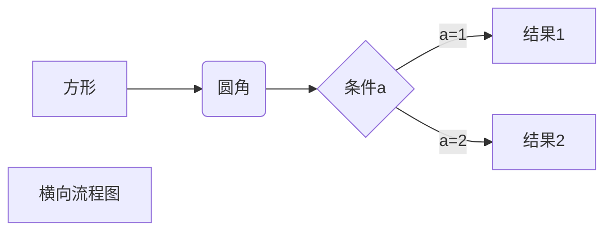
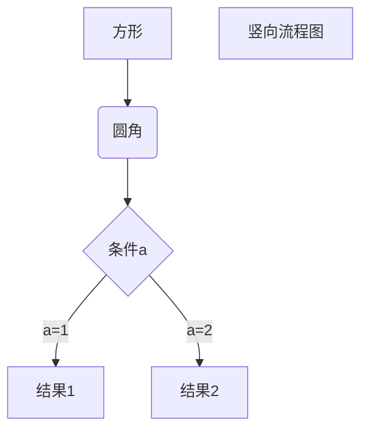

# 一级标题

## 二级标题

## 二级标题

### 三级标题

#### 四级标题

##### 五级标题

###### 六级标题

段落开始：**加粗**、*倾斜*、<u>下划线</u>、~~删除线~~、==高亮==

符号链接：上标^上标^、下标~下标~、[链接](链接)、[链接][链接]、


语义符号：`代码`、脚注[^1]

- [ ] jjjjjj

> - [ ] 哈哈哈哈哈哈哈

块元素：

+ 无序列表
+ 充分等等
  + 无序列表的递进
  + 仍然会好久哦经济
    1. 无序列表下的有序列表
    2. 日日日动词
       1. 有序列表下的递进
       2. 顶顶顶方法
          - [ ] 待办事项
          - [x] 

> 引用内容。Lorem ipsum dolor sit amet, consectetur adipiscing elit, sed do eiusmod tempor incididunt ut labore et dolore magna aliqua. Ut enim ad minim veniam, quis nostrud exercitation ullamco laboris nisi ut aliquip ex ea commodo consequat. Duis aute irure dolor in reprehenderit in voluptate velit esse cillum dolore eu fugiat nulla pariatur. Excepteur sint occaecat cupidatat non proident, sunt in culpa qui officia deserunt mollit anim id est laborum.
>
> > 二层引用Lorem ipsum dolor sit amet, consectetur adipiscing elit, sed do eiusmod tempor incididunt ut labore et dolore magna aliqua. Ut enim ad minim veniam, quis nostrud exercitation ullamco laboris nisi ut aliquip ex ea commodo consequat. Duis aute irure dolor in reprehenderit in voluptate velit esse cillum dolore eu fugiat nulla pariatur. Excepteur sint occaecat cupidatat non proident, sunt in culpa qui officia deserunt mollit anim id est laborum.
> >
> > > 三层引用Lorem ipsum dolor sit amet, consectetur adipiscing elit, sed do eiusmod tempor incididunt ut labore et dolore magna aliqua. Ut enim ad minim veniam, quis nostrud exercitation ullamco laboris nisi ut aliquip ex ea commodo consequat. Duis aute irure dolor in reprehenderit in voluptate velit esse cillum dolore eu fugiat nulla pariatur. Excepteur sint occaecat cupidatat non proident, sunt in culpa qui officia deserunt mollit anim id est laborum.

```html
<html>
	<head>
        <titile>this is a html file</titile>
    </head>
    <body>
        <div id="head title">
            <p>
                <span class="para highlight">highlight paragraph</span>
            </p>
            
        </div>
    </body>
```

---

<hr width=50%>

<hr width=30%>

居中文字：注意居中文字必须单独为一行。

<center>居中文字</center>

其他内容：

| 左对齐 | 右对齐 | 居中对齐 |
| :----- | -----: | :------: |
| 单元格 | 单元格 |  单元格  |
| 单元格 | 单元格 |  单元格  |

\*\* 正常显示星号 \*\*





[^1]: 脚注。Lorem ipsum dolor sit amet, consectetur adipiscing elit, sed do eiusmod tempor incididunt ut labore et dolore magna aliqua.

