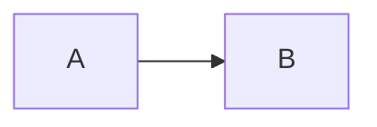
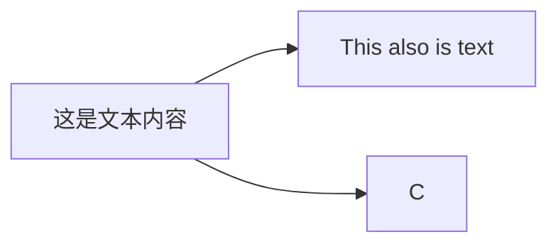
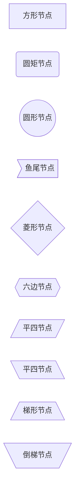
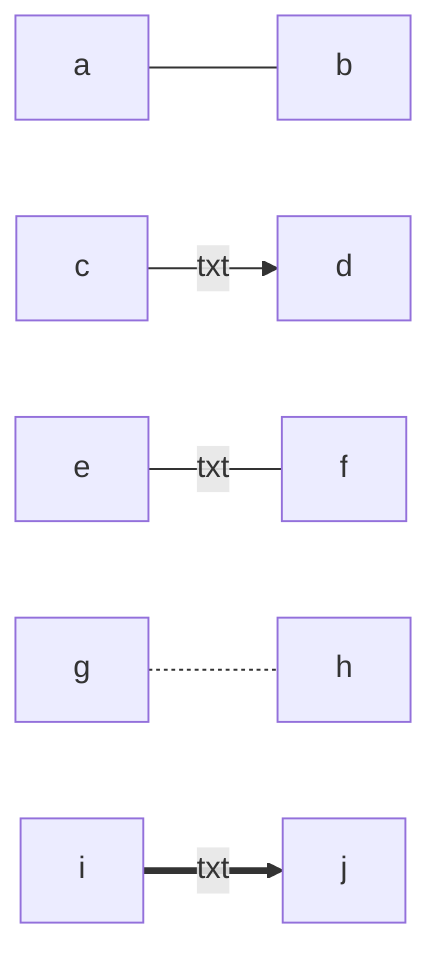
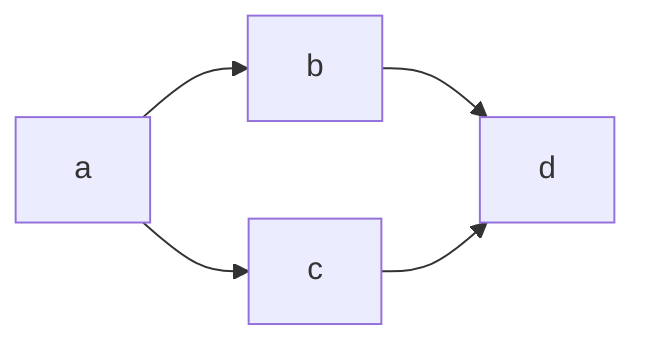

# Mermaid

## 说明程式

首先需要向编辑器说明需要使用的标记方式。

```
​```mermaid

​```
```

使用以上三行代码来说用将要使用 `mermaid` 来绘制图表。只需将需要代码置入中间即可。

## 设定方向

向编辑器说明了标记方式，接下来就需要设定图标的方向。

```
graph TD
OR
graph TB
OR
graph LR
```

需要说明的是 `T` 代表 `TOP`，`B` 或者 `D` 代表 `BOTTOM`，所以 `TD` 或者 `TB` 就代表图标的方向是从上至下。反之亦同。同理，`L` 和 `R` 分别代表左和右。一个简单的示例如下：

```
​```mermaid
graph LR
A --> B
​```
```



## 图表内容

如上面的示例，在一个图表中会存在很多的不同的相互连接的内容，可以称为**节点**。每个节点可以直接使用想要表达的内容，或者使用一个符号来替代。一个简单的示例如下：

```
​```mermaid
graph LR
A[这是文本内容] --> B[This also is text]
A --> C
​```
```



我们可以看到当使用 `A[这是文本内容]` 时，我们使用 `A` 替代了 `[]` 内的内容来直接连接到 `C` 节点。

另外可以注意到，链接不同节点使用的符号是 `-->`。

另外，节点的形状是可以改变的。一般的示例如下：

一个方形节点：`A[方形节点]`

一个圆矩节点：`B(圆矩节点)`

一个圆矩节点：`C([圆矩节点])`

一个圆形节点：`D((圆形节点))`

一个鱼尾节点：`E>鱼尾节点]`

一个菱形节点：`F{菱形节点}`

一个六边节点：`G{{六边节点}}`

一个平四节点：`H[/平四节点/]`

一个平四节点：`I[\平四节点\]`

一个梯形节点：`J[/梯形节点\]`

一个倒梯节点：`K[\倒梯节点/]`



## 链接样式

节点之间的连接方式除了上例的箭头之外还有：

一条直线：`---`

文本直线：`-- text –-` or `---|text|`

箭头文本：`-- text -->` or `–->|text|`

虚线箭头：`-.->`

虚线文本：`-. text .->`

粗链接：`==>`

文本粗链接：`== txt ==>`

一些简单的示例如下：



另外可以使用 `&` 来连接同一行众多个节点。



另外尽量不要在链接内容上添加特殊符号。